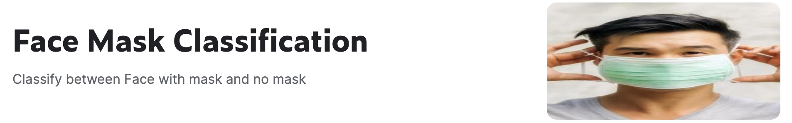
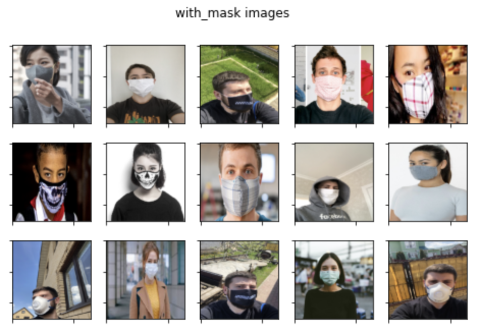
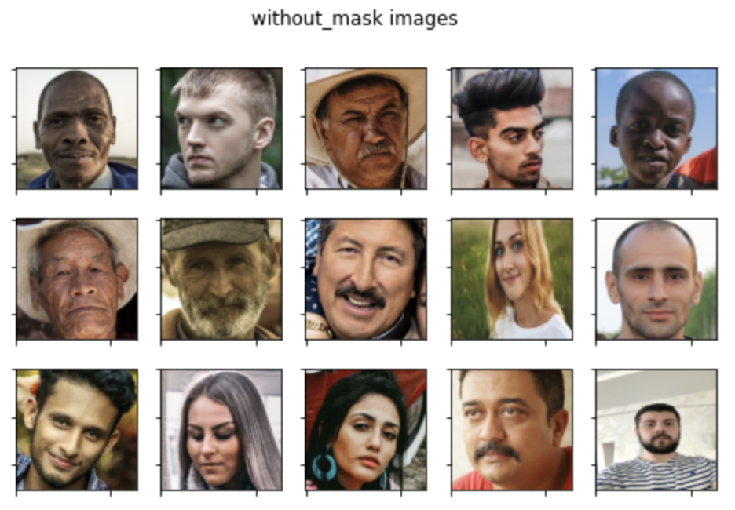

# Mask Classification

2022 likelion ais7 Mini Project 6

### 👫 Team
오9오9 - 조예슬, 김예지, 이정은, 임종우, 권태윤

 

## 😷 Face Mask Classification 😷
Classify between Face with mask and no mask

   

  
  
### 🗂 Data 

**Kaggle Dataset** : **Face Mask Classification**                    
주소 : <https://dacon.io/competitions/official/235961/overview/description>

[Face Mask Classification](https://www.kaggle.com/datasets/dhruvmak/face-mask-detection)에서 제공된 데이터를 다운받아 이용하였다. 

 

**📁 with_mask [folder]**   

  

마스크를 착용한 사진 220장을 포함하고 있음   

**📁 without_mask [folder]**                  

  

마스크 미착용한 사진 220장을 포함하고 있음    

